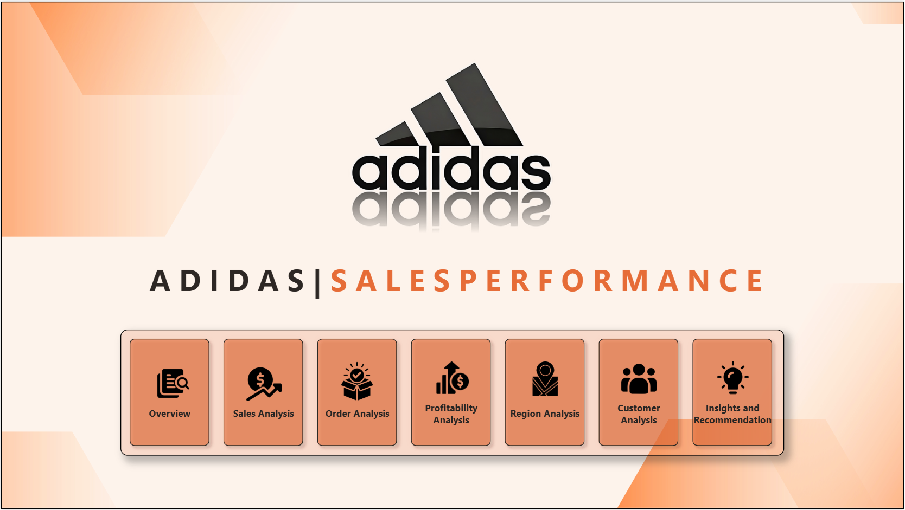
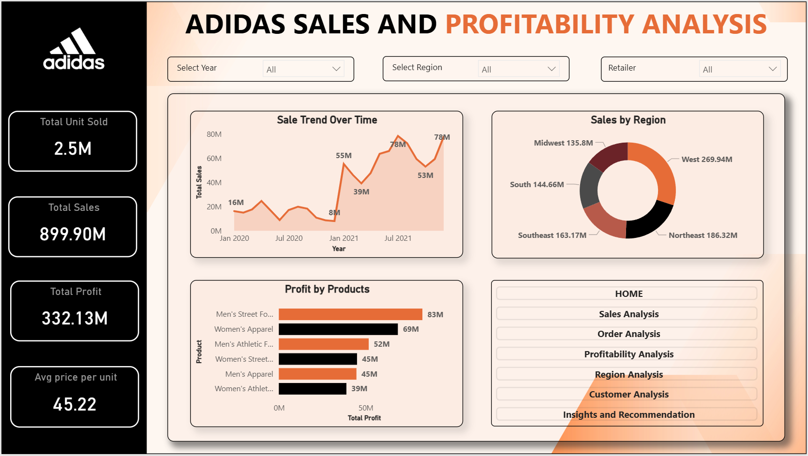

# Adidas Sales Performance Analysis — Power BI Dashboard

An interactive Power BI dashboard analyzing Adidas sales performance across regions, products, retailers, and customers — built to uncover trends in revenue, profitability, and order patterns.

## 📊 Dashboard Pages

### 1. Home
Landing page of the report with navigation buttons to all other pages, giving users a quick overview of what the dashboard offers.

### 2. Overview
A high-level summary of overall business performance — total sales, total profit, units sold, and total orders, along with key trend visuals for a quick snapshot of company health.

### 3. Sales Analysis
A deep dive into sales performance — revenue trends over time, sales by product category, and comparison across different segments to identify top and bottom performers.

)

### 4. Order Analysis
Analyzes order volume and patterns — number of orders over time, average order value, and order distribution across retailers or sales channels.

### 5. Profitability Analysis
Breaks down profit margins and profitability by product, region, or retailer, helping identify which segments generate the most (and least) profit.

### 6. Region Analysis
Geographic breakdown of sales performance, comparing revenue and profit across different states/regions to highlight the strongest and weakest markets.

### 7. Customer Analysis
Focuses on customer/retailer-level insights — top retailers by sales, customer segmentation, and purchasing behavior trends.

### 8. Insights and Recommendations
Summarizes key findings from the analysis and provides actionable business recommendations based on the data.

---

## 🗂️ Data Source

- **Dataset:** *[Add source here — e.g., "Adidas US Sales Dataset (Kaggle)"]*

## 📈 Key Metrics Tracked

- Total Sales / Revenue
- Total Profit & Profit Margin
- Units Sold
- Total Orders
- Sales by Region
- Sales by Retailer/Customer
- Sales by Product Category

## 🛠️ Tools & Technologies

- **Power BI Desktop** — report building & visualization
- **Power Query (M)** — data cleaning and transformation
- **DAX** — calculated measures and KPIs

